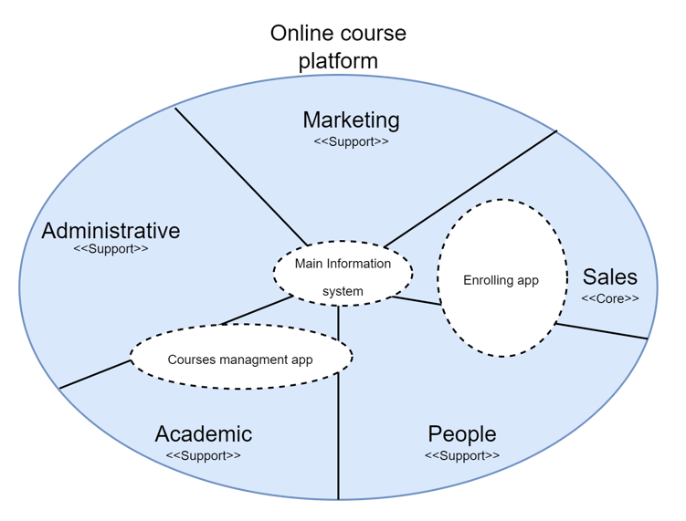
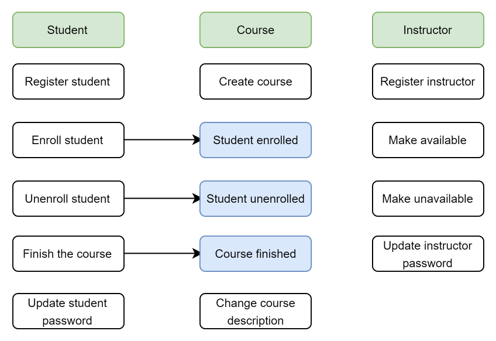
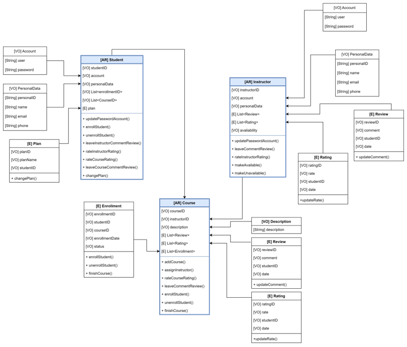
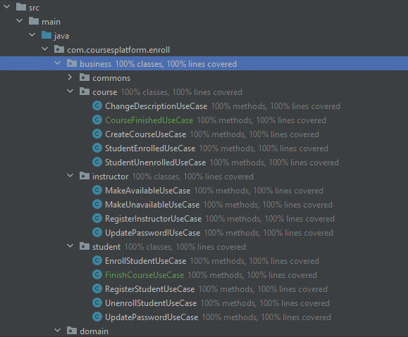

# DDD final project
## Enrollment app for an online course platform

This project is a backend application to manage the dynamics of student enrollment in an online course platform. It was developed under the DDD approach. The strategical part is defined as follows:

### Big picture
The big picture is related to the online course platform company as the domain, where several important subdomains are presented. In this exercise, the application is related with the Sales subdomain and the people subdomain, since sales is in charge of managing the relationship with the customers or students, and the offer, which is the main information about the courses. People domain, is related to the company's human resources unit, and is associated with the management of instructors information.

### Bounded context and Ubiquitous language
A bounded context was identified for the development of the application, which involves the sales and the people subdomains. As shown in the image bellow, inside the bounded context (blue rectangle) are allocated the main entities identified, where student, instructor and course are the aggregate roots for this solution. In the second image, the behaviors of these entities are shows, where the blue ones, with an "event" name, are highlighted since they are behaviors that depend on the behaviors of another aggregate root, and then, they are implemented in the event driven use cases.

### Domain model
A domain model was developed for the enrollment application. The aggregate roots and its entities and main value objects are presented, as well as the relations between them.

### Use cases

#### Command driven use cases
* RegisterStudent: register a student in the system with its account, personal data and plan associated.
* EnrollStudent: add a course to the the enrollment list of the student entity.
* UnenrollStudent: removes a course from the student entity through the enrollment list.
* UpdatePassword: updates the password of the student.
* Finish course: removes a course from the the enrollment list of the student entity. It triggers an event to change a status in the course aggregate root.
* RegisterInstructor: register an instructor in the system.
* MakeAvailable: makes the instructor available.
* MakeUnavailable: makes the instructor unavailable.
* UpdatePasswordI: updates the password of the instructor.
* CreateCourse: creates a course.
* ChangeDescription: change the course description.

#### Command driven use cases
* StudentEnrolled: unenroll a student in the enrollment list of the course based on the event triggered by the unenrollStudent use case.
* StudentUnenrolled: enroll a student in the enrollment list of the course based on the event triggered by the unenrollStudent use case.
* CourseFinished: change the status of the enrollment based on the event triggered by the finishCourse use case.

### Coverage
The image bellow the 100% test coverage of the use cases is shown.

